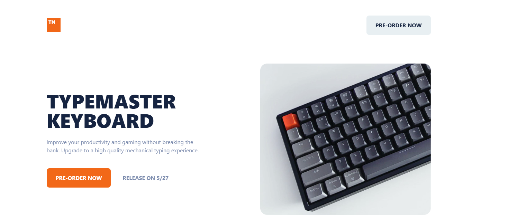
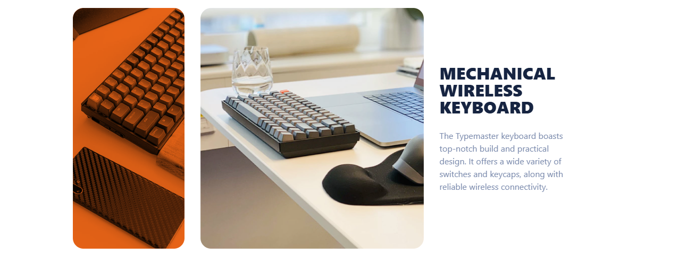
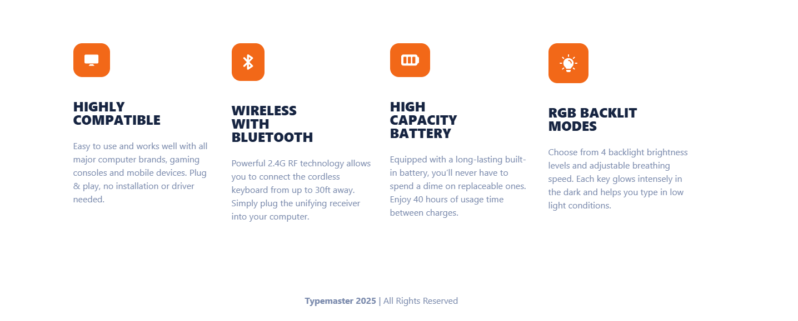

⌨️ Typemaster Landing Page

A responsive Typemaster Landing Page built as part of a Frontend Mentor challenge.
The project focuses on building a modern product landing page with structured sections, responsive layouts, and clean UI design.

🚀 Features

- Modern product landing page layout
- Hero section with product focus
- Feature sections describing the product
- Call-to-action buttons
- Responsive layout (mobile → desktop)
- Clean modern UI design

| Technology       | Purpose                 |
| ---------------- | ----------------------- |
| **HTML5**        | Semantic page structure |
| **CSS3**         | Styling and layout      |
| **CSS Grid**     | Main layout system      |
| **Flexbox**      | Alignment and spacing   |
| **GitHub Pages** | Deployment              |

📸 Sections

Hero Section

Footer Section

